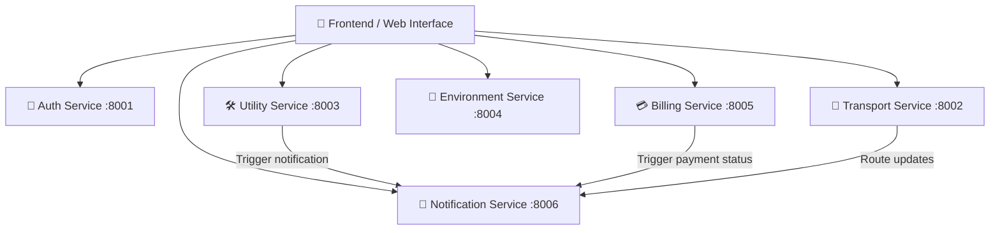

# 🏙️ Smart City Microservices Project

Выполнил: Овчинников Даннил 2471


Комплексная микросервисная система «Умный Город», построенная на базе **FastAPI**, **SQLite** и асинхронного взаимодействия. Проект предоставляет единую экосистему для управления городскими службами: авторизацией, ЖКХ, транспортом, экологическим мониторингом, биллингом и уведомлениями.

---

## 📐 Архитектура системы

Система состоит из 6 независимых микросервисов, взаимодействующих между собой по HTTP протоколу (REST API), и единого веб-интерфейса (Frontend).



---

## 🚀 Описание микросервисов

| Сервис | Порт | Описание | Основные сущности / функции |
| :--- | :---: | :--- | :--- |
| **Auth Service** | `8001` | Аутентификация и регистрация пользователей | Выдача JWT-токенов, управление профилями жителей |
| **Transport Service** | `8002` | Отслеживание и управление городским транспортом | Маршруты, расписания, остановки, статус движения |
| **Utility Service** | `8003` | Заявки в службы ЖКХ и городские службы | Создание и отслеживание статуса заявок на ремонт |
| **Environment Service** | `8004` | Мониторинг экологии и качества воздуха | Индекс качества воздуха (AQI), температура, влажность |
| **Billing Service** | `8005` | Управление счетами и оплата услуг | Выставление счетов за ЖКХ, история платежей, баланс |
| **Notification Service**| `8006` | Центр отправки уведомлений | Push-оповещения, системные логи, сервисные события |

---

## 🛠️ Технологический стек

* **Язык программирования:** Python 3.12+
* **Фреймворк:** FastAPI (Uvicorn)
* **База данных:** SQLite (для каждого микросервиса отдельная локальная БД)
* **Менеджер пакетов:** `uv` / `pip`
* **Фронтенд:** HTML5, Tailwind CSS, Vanilla JavaScript

---

## 📂 Структура проекта

```text
smart_city/
├── frontend/
│   └── index.html         # Единый дашборд управления
├── services/
│   ├── auth/              # Сервис авторизации (main.py)
│   ├── billing/           # Сервис биллинга (main.py)
│   ├── environment/       # Сервис экологии (main.py)
│   ├── notification/      # Сервис уведомлений (main.py)
│   ├── transport/         # Сервис транспорта (main.py)
│   └── utility/           # Сервис ЖКХ (main.py)
├── .gitignore             # Исключения для Git
├── pyproject.toml         # Зависимости и конфигурация
├── README.md              # Документация проекта
├── schema.sql             # SQL-схема всех баз данных
├── start.sh               # Скрипт параллельного запуска всех сервисов
└── uv.lock                # Lock-файл зависимостей
```

---

## ⚙️ Установка и запуск

### 1. Клонирование репозитория
```bash
git clone <url-вашего-репозитория>
cd smart_city
```

### 2. Установка зависимостей
С использованием менеджера `uv`:
```bash
uv sync
```
Или через стандартный `pip`:
```bash
pip install -r pyproject.toml
```

### 3. Запуск микросервисов
Для автоматического запуска всех 6 сервисов используйте комплектный скрипт `start.sh`:

```bash
chmod +x start.sh
./start.sh
```

Каждый сервис автоматически создаст свою базу данных SQLite при первом старте и заполнит ее тестовыми данными при необходимости.

### 4. Запуск Frontend
Откройте файл `frontend/index.html` в любом браузере или запустите локальный веб-сервер:
```bash
python -m http.server 8000 --directory frontend
```

---

## 📑 Интерактивная документация API

После запуска сервисов Swagger-документация доступна для каждого из них по адресу:
* **Auth API:** [http://localhost:8001/docs](http://localhost:8001/docs)
* **Transport API:** [http://localhost:8002/docs](http://localhost:8002/docs)
* **Utility API:** [http://localhost:8003/docs](http://localhost:8003/docs)
* **Environment API:** [http://localhost:8004/docs](http://localhost:8004/docs)
* **Billing API:** [http://localhost:8005/docs](http://localhost:8005/docs)
* **Notification API:** [http://localhost:8006/docs](http://localhost:8006/docs)
